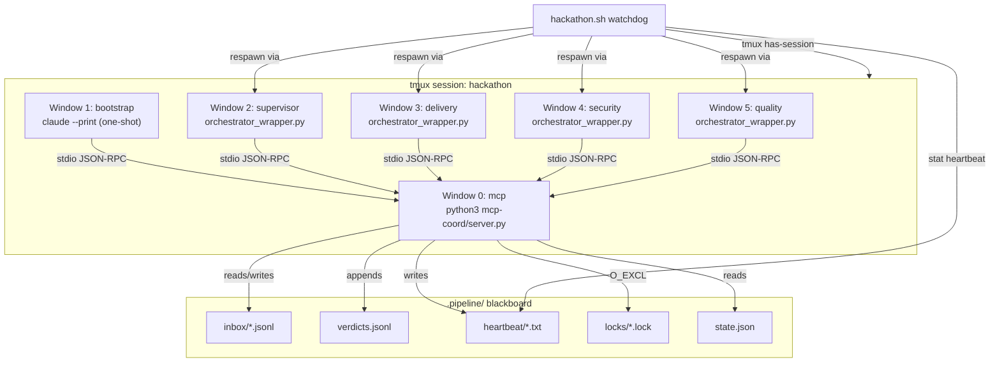
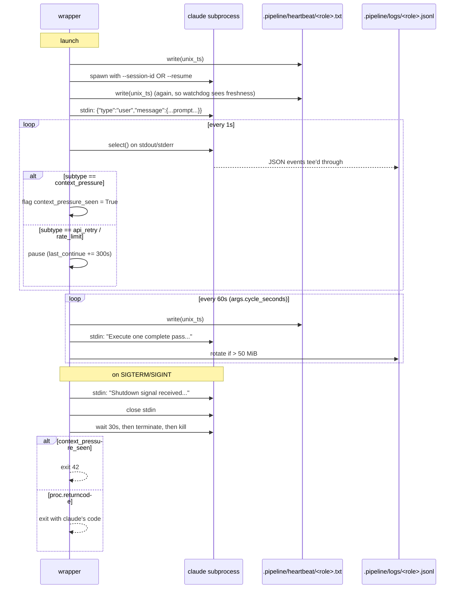
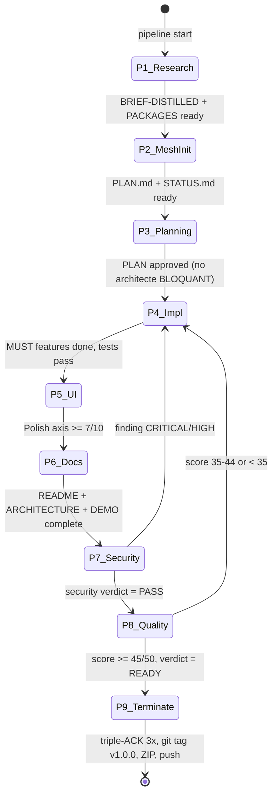
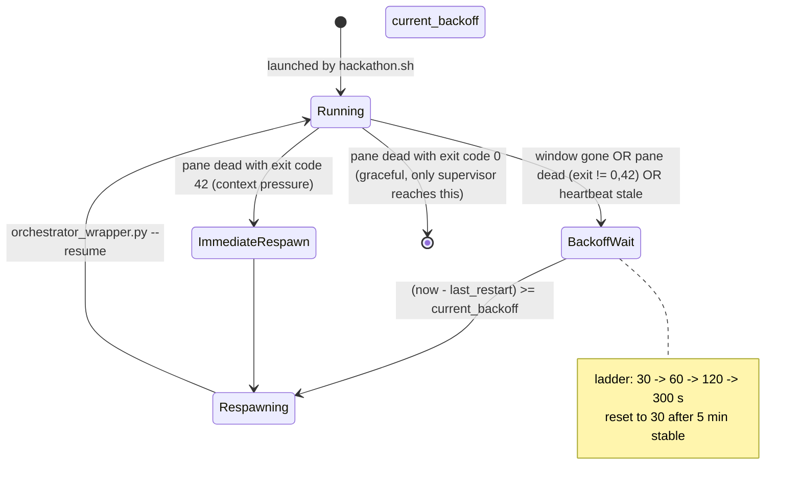
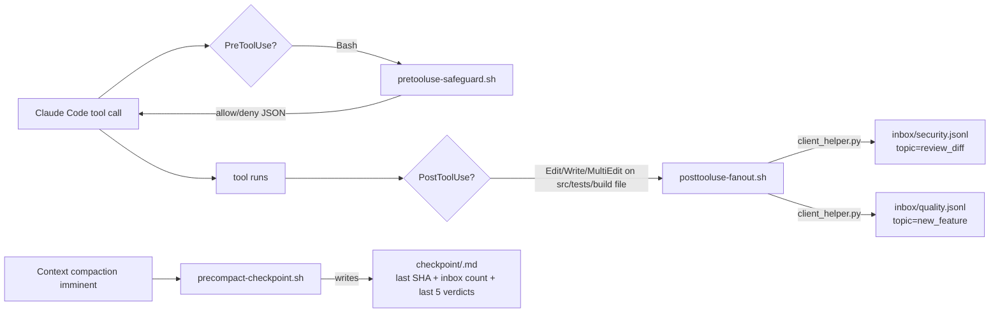

# Architecture

This document describes how the pipeline is wired: the process topology, the file-based coordination, the message flows, and the failure modes. If the code and this document disagree, the code is right.

For the user-facing overview and the configuration reference, see [README.md](README.md). For the raw protocol prose that the orchestrators themselves read, see the `.claude/orchestrators/*.prompt.md` files.

## Process topology

Everything runs inside one tmux session named `hackathon` (defined at `hackathon.sh:18`). Each window is a single Claude Code or Python process; no window ever spawns another.



The bash process that launched the session is still alive: it runs the watchdog loop at `hackathon.sh:1335-1537`. Detaching tmux with `Ctrl+B D` does not stop it.

## Layer breakdown

### Launcher (`hackathon.sh`, 1537 lines)

- `auto_setup()` (lines 93-235): 6 steps, idempotent. Installs apt packages, GitHub CLI, configures passwordless sudo for `apt-get`/`mkdir`/`tee`/`chmod`, installs 4 Claude Code plugins + 1 marketplace skill.
- `interactive_config()` (lines 251-502): reads or generates `hackathon.conf`. Validates the generated file with `bash -n` before continuing.
- `setup_safeguards()` (lines 508-663): writes `$PROJECT_DIR/.claude/settings.json`. Merges existing settings with `jq` on re-run; `unique` dedups the allow/deny lists.
- `launch_claude_in_tmux()` (lines 672-708): used only by the ultraplan path. Writes a heredoc-wrapped script into `/tmp/hackathon-cmd-XXXXXX.sh`, starts tmux with the script as the session's initial process (avoids `send-keys` race conditions documented in Claude Code issues #40168, #33987, #37217).
- `check_launch_preconditions()` (lines 943-998): refuses to launch if any orchestrator prompt is missing, `.pipeline/mcp.json` is invalid, or `agents/` has fewer than 15 files.
- `launch_claude_window()` (lines 1063-1112): one-shot bootstrap uses plain `claude --print`; the other four roles go through `orchestrator_wrapper.py`.
- Watchdog loop (lines 1335-1537): every 30s, checks each role, respawns on crash or stale heartbeat, with the backoff ladder below.

### Orchestrator wrapper (`mcp-coord/orchestrator_wrapper.py`, 352 lines)

Spawns `claude --print --input-format stream-json --output-format stream-json` as a subprocess and keeps it alive between cycles.



Key decisions:
- The first heartbeat is written **before** `sleep 2` and before stdin is fed, so the watchdog does not kill the process during claude's first-turn processing.
- `--resume` is used when `args.log_file` exists and is non-empty; otherwise `--session-id`. Session IDs are deterministic UUIDv5 per role (see `role_session_id()` at `hackathon.sh:737-743`), so `--resume` always targets the right conversation.
- Exit 42 is the signal for "clean context-pressure exit, please respawn with `--resume`". The watchdog honors it without incrementing backoff.
- Rate-limit pause (300s) pushes `last_continue` forward so the next cycle will wait out the quota window before the next continue message.

### MCP coordinator (`mcp-coord/server.py`, 869 lines)

FastMCP stdio server. Single global `Coordinator` instance; 8 tools are thin wrappers around it.

Filesystem layout under `$PIPELINE_DIR` (default `$PROJECT_DIR/.pipeline/`):

```
.pipeline/
├── inbox/
│   ├── supervisor.jsonl       # pending messages; claim_next pops FIFO
│   ├── supervisor.claimed.jsonl  # audit of what's been popped
│   ├── delivery.jsonl
│   ├── security.jsonl
│   ├── quality.jsonl
│   ├── bootstrap.jsonl
│   └── _dedup.jsonl           # {message_id, ts} per posted message, 24h TTL
├── verdicts.jsonl             # append-only; {role, status, sha, seq, ts, evidence?, findings?}
├── state.json                 # {cycle, last_gate, last_gate_decision, last_gate_ts, _seq, started_at}
├── heartbeat/
│   └── <role>.txt             # unix timestamp, atomic temp+rename
├── locks/
│   ├── <sha1(path)>.lock      # {owner, acquired_at, ttl_seconds, path, token}
│   └── audit.jsonl            # every takeover and release
├── dead-letter/
│   └── <ULID>.json            # malformed JSON or rejected messages
├── logs/                      # <role>.jsonl tee'd from orchestrator stdout
├── checkpoint/                # written by PreCompact hook + orchestrator self-checkpoints
├── mcp-server.log             # file-only logger (stderr stays clean for JSON-RPC)
└── mcp.json                   # patched by hackathon.sh to use the venv python path
```

Atomicity invariants:
- `_atomic_append` uses `O_APPEND + fsync` on a single `os.write()`. No line can be partially written.
- `_atomic_write_json` writes to `mkstemp` in the same directory, `fsync`, then `rename`. Crash-safe.
- `claim_next` opens the inbox with `r+b`, takes `flock(LOCK_EX)`, reads the first line, then seeks and copies the rest forward in 65536-byte chunks. `truncate` shrinks the file. This is O(n) I/O and O(1) RAM. Will not OOM on a huge inbox.
- `acquire_file_lock` tries `O_EXCL` first. On `FileExistsError`, it checks the TTL of the existing lock; if expired, deletes and retries `O_EXCL`. If the second `O_EXCL` also fails, another process won the race and we return `{status: "held"}`. Takeovers are audited with `{event: "takeover", old_owner, new_owner}`.

Validation layers:
- `VALID_ROLES = {supervisor, delivery, security, quality, bootstrap}`. Everything else is rejected on `from_role`/`to_role`/`role`.
- `ALLOWED_TOPICS`: 20 entries, listed below.
- `VERDICT_STATUSES`: per-role whitelist:
  - delivery: `IN_PROGRESS | BUILT | DONE | BLOCKED`
  - security: `PASS | FAIL | STALE`
  - quality: `READY | READY_WITH_FIXES | NOT_READY | STALE`
- `VALID_GATES = {gate_security, gate_quality, gate_terminate}`.
- `acquire_file_lock` rejects any path containing `..` and any absolute path outside `REPO_ROOT`.

## Message topics

20 topics are accepted by `post_message`. Anything else returns `{"status": "error", "error": "unknown topic ..."}`.

| Topic | Typical sender | Typical recipient | Meaning |
|---|---|---|---|
| `implement` | supervisor | delivery | Dispatch a task from `docs/PLAN.md`. |
| `review_diff` | supervisor | security | Audit the diff from `last_reviewed_sha` to `HEAD`. |
| `new_feature` | supervisor | quality | Re-evaluate axes affected by the new commit. |
| `sec_ok` | security | supervisor | Security PASS for a given SHA. |
| `finding` | security | delivery (via supervisor) | One vulnerability, with severity in the payload. |
| `regression` | quality | delivery (via supervisor) | A feature that used to work no longer does. |
| `fix_applied` | delivery | security | A finding was addressed; re-audit the changed lines only. |
| `blocked` | any | supervisor | Cannot proceed; payload describes why. |
| `veto` | security/supervisor | delivery | Stop immediately. Payload carries the reason. |
| `veto_last_commit` | any | delivery | Revert `HEAD` via `git revert HEAD --no-edit`. |
| `lock_conflict` | any | supervisor | A file lock is contended for longer than expected. |
| `context_pressure` | any | supervisor | Soft signal (60%) or hard signal (80%); 80% triggers exit 42. |
| `gate_security` | supervisor | self | Probe `state.json` for a cached decision. |
| `gate_quality` | supervisor | self | Same, for the quality gate. |
| `ping` | any | any | Liveness probe; recipient responds with `heartbeat()`. |
| `shutdown` | supervisor | all | Triple-ACK termination step 7. Recipients reply with `shutdown` + payload `ACK`. |
| `suggest_edit` | quality | supervisor → delivery | Prioritized fix list (max 5 per cycle). |
| `split_request` | delivery | supervisor | Current task exceeds 400 LOC / 8 files / 1 dep. |
| `stuck` | any | supervisor | A role has been unable to make progress for N cycles. |
| `conflict` | delivery | supervisor | Git merge conflict or file-ownership contention. |

The topic set is defined at `mcp-coord/server.py:41-46`. Any addition must be made in three places: the frozenset, the orchestrator prompts that handle it, and `mcp-coord/client_helper.py`'s fallback copy.

## Sole-writer discipline

Every file has exactly one writer role. This is enforced by convention, not by the filesystem. Orchestrators that violate it are supposed to catch themselves in their own prompts; the CLAUDE.md template and each orchestrator prompt repeat this table.

| Files | Writer |
|---|---|
| `src/**`, `tests/**`, `package.json` / `Cargo.toml` / `pyproject.toml`, build configs, `.env.example`, `README.md`, `docs/ARCHITECTURE.md`, `docs/DEMO.md` | delivery |
| `docs/PLAN.md`, `docs/STATUS.md`, `docs/DECISIONS.md` | supervisor |
| `docs/SECURITY-AUDIT.md` | security |
| `docs/QUALITY-REPORT.md` | quality |
| `notes/BRIEF-DISTILLED.md`, `notes/PACKAGES.md` | bootstrap specialists + on-demand with `acquire_file_lock` |
| `ui-primitives/` (in the target project) | delivery via implementeur or ui-quality-reviewer |
| `.pipeline/**` | MCP server only (never written directly) |

When a role needs to touch a file outside its own column (rare, usually `notes/`), it must `acquire_file_lock(path, owner=<role>, ttl_seconds=120)` first and `release_file_lock` when done. The lock TTL defaults to 120s. Longer holds are considered bugs and are taken over automatically with an audit entry.

## Pipeline phases

The nine phases are specified in `templates/CLAUDE.md.template:140-634`. Each has an owner, a trigger, the files it produces, and an exit gate. The pipeline does not advance until the current phase's gate passes.



- Phase 1 (Competitive research): bootstrap window's docs-reader reads `inputs/`, package-research researches deps, produces `notes/`.
- Phase 2 (Mesh init): supervisor reads the notes and writes `docs/PLAN.md` + initial `docs/STATUS.md`.
- Phase 3 (Planning): supervisor dispatches `implement` messages; delivery's architecte validates the first task before any code is written.
- Phase 4 (Implementation): delivery's implementeur writes code + tests. Hard cap per task: 400 LOC, 8 files, 1 new dep. Exceeding triggers a `split_request`.
- Phase 5 (UI): ui-quality-reviewer scores Polish /10. Delivery iterates on `suggest_edit` messages from quality until Polish ≥ 7.
- Phase 6 (Docs): readme-specialist produces `README.md`, `docs/ARCHITECTURE.md`, `docs/DEMO.md`, `.env.example`. docs-auditor runs the 7-phase documentation protocol.
- Phase 7 (Security audit): security runs the 9-phase protocol. FAIL → findings to delivery → fixes → re-audit only the changed lines.
- Phase 8 (Quality eval): quality scores /50 across Completude, Polish, Innovation, Presentation, Robustness. Score < 35 sends `blocked` to supervisor; 35-44 sends `suggest_edit`; ≥ 45 is READY.
- Phase 9 (Termination): only the supervisor runs this, following the triple-ACK sequence below.

## Triple-ACK termination

The only way the pipeline exits cleanly. Defined at `.claude/orchestrators/supervisor.prompt.md:180-287`.

**Entry precondition (ALL must hold simultaneously):**
- `V_delivery(HEAD_SHA) = DONE`
- `V_security(HEAD_SHA) = PASS` with no open CRITICAL/HIGH
- `V_quality(HEAD_SHA) = READY` with score ≥ 45
- `HEAD` unchanged for 3 consecutive cycles (≥ 90s)
- No new inbox messages to any peer during those 3 cycles

If `HEAD` advances, all prior verdicts are stale. Stale verdicts do NOT satisfy the entry precondition. The supervisor re-posts `review_diff` to security and `new_feature` to quality for the new `HEAD_SHA`, and the counter resets to 0.

**Sequence** (each step idempotent):

```mermaid
sequenceDiagram
    participant S as supervisor
    participant D as delivery
    participant Sec as security
    participant Q as quality
    participant Git as local git
    participant GH as origin
    participant TG as Telegram

    Note over S: gate holds for 3 cycles

    S->>D: post_message(freeze)
    S->>Sec: post_message(freeze)
    S->>Q: post_message(freeze)
    Note over S: sleep 30 (one cycle)

    S->>Git: SEALED_SHA = git rev-parse HEAD
    alt HEAD advanced
        S->>D: post_message(unfreeze)
        S->>Sec: post_message(unfreeze)
        S->>Q: post_message(unfreeze)
        Note over S: abort; re-enter from scratch
    end

    S->>Git: git tag v1.0.0 SEALED_SHA
    alt tag already exists, same SHA
        Note over S: idempotent short-circuit
    else tag exists, different SHA
        S->>D: post_message(termination_error)
        Note over S: FAIL LOUD, stop
    end

    S->>Git: git archive --format=zip --prefix=SLUG/ v1.0.0 -o SLUG-submission.zip
    S->>Git: test -s SLUG-submission.zip (catches disk-full truncation)

    loop delay in 0,2,4,8,16 s
        S->>GH: git push origin HEAD:master
        S->>GH: git push origin v1.0.0
    end
    alt all 5 attempts fail
        S->>D: post_message(termination_error) with last stderr
        Note over S: FAIL LOUD, stop
    end

    S->>TG: tg_send("HACKATHON TERMINÉ …")
    S->>S: append TERMINATED line to docs/STATUS.md

    S->>D: post_message(shutdown)
    S->>Sec: post_message(shutdown)
    S->>Q: post_message(shutdown)
    loop up to 120s
        S->>S: claim_next for shutdown ACKs
    end
    Note over S: record did_not_ack peers in DECISIONS.md

    S->>S: append "Termination complete, exit code 0" to STATUS.md
    S-->>S: exit 0
```

What the supervisor **does not** do during termination:
- No new commits. The sealed SHA is what ships.
- No tool calls beyond the exact git/archive/push calls in steps 3-5 and the `docs/STATUS.md` / `docs/DECISIONS.md` appends.
- Does NOT force-push. A non-fast-forward is surfaced to a human.
- Does NOT edit code, tests, build files, or `.pipeline/`.

## Watchdog state machine

Per orchestrator role. Cycle: 30s. Heartbeat freshness threshold: 120s after a 60s initial grace period.



Only the supervisor emits exit 0. Delivery, security, and quality are expected to loop indefinitely until the supervisor posts `shutdown`; they then ACK and exit 0 too.

Bootstrap is one-shot. The watchdog flips a `BOOTSTRAP_DONE=true` flag the first time its window disappears or its pane dies (any exit code). It is never respawned.

MCP is checked first each cycle. If its window is gone or its pane is dead, it is respawned before any orchestrator is considered, because all orchestrators depend on it.

## Hook fan-out

`setup_safeguards()` wires three hooks into `$PROJECT_DIR/.claude/settings.json`:



- `pretooluse-safeguard.sh` parses `.tool_input.command` with `jq`, checks 12 dangerous patterns (rm -rf /, git push --force, chmod 777, mkfs., dd if=, curl|bash, history -c, git filter-branch, git push --mirror, …) and `/mnt/[a-z]/` Windows-mount access. Fails closed if `jq` is missing, fails open on non-JSON input (covers tool calls that aren't Bash).
- `posttooluse-fanout.sh` is observational only; it never blocks. It debounces via `.pipeline/last-fanout.txt`: if the last fanout was for the same SHA within 30s, it skips.
- `precompact-checkpoint.sh` uses `CLAUDE_SESSION_ID` to derive the role name. Never blocks compaction (exit 0 with no JSON).

## Secrets redaction

The watchdog forwards `docs/STATUS.md` HUMAN_INPUT_NEEDED blocks to Telegram. Before sending, `_redact_secrets()` (hackathon.sh:1294-1309) masks known key patterns:

| Pattern | Example | What's kept |
|---|---|---|
| `hc_live_...` | `hc_live_abcd1234…EFGH` | `hc_live_abcd…REDACTED…EFGH` |
| `hc_test_...` | same | same |
| `sk-...` | `sk-proj-abcd…XYZ` | `sk-proj…REDACTED…XYZ` |
| `ghp_...` | `ghp_abcd1234…XYZ0` | `ghp_abcd…REDACTED…XYZ0` |
| `pk_...` | `pk_live_abcd…` | `pk_live…REDACTED…` |
| `xox[bpsa]-...` | Slack tokens | same |
| `glpat-...` | GitLab PATs | same |
| `AKIA...` | AWS access keys | same |
| `*_SECRET`, `*_TOKEN`, `*_PASSWORD`, `*_APIKEY`, `*_API_KEY` | any shell-style assignment | value replaced with `***REDACTED***` |

This is defense-in-depth. The primary guard is the orchestrator prompt rule "never put secrets in STATUS.md".

## Failure modes and how they're handled

| Failure | Detector | Recovery |
|---|---|---|
| Orchestrator crashes with non-zero exit | watchdog, pane_dead check | respawn via `orchestrator_wrapper.py --resume`, incremented backoff |
| Context pressure hits 80% | orchestrator self-exits with code 42 | watchdog respawns immediately, no backoff |
| Heartbeat not updated for >120s | watchdog, after 60s grace period | respawn, backoff ladder applies |
| MCP server dies | watchdog (checked first each cycle) | `tmux respawn-window -k` with the same command |
| Bootstrap fails | not recovered; BOOTSTRAP_DONE flips anyway | human must restart the pipeline |
| Git merge conflict in delivery | delivery posts `conflict` to supervisor | supervisor writes to `docs/DECISIONS.md`, posts resolution |
| Token invalid at `tg_init` | `tg_init` sets `TELEGRAM_ENABLED=false` | pipeline continues without notifications |
| Lock held past TTL (120s default) | `acquire_file_lock` compares `acquired_at + ttl_seconds` to `now` | automatic takeover, `audit.jsonl` records `{event: "takeover", old_owner, new_owner}` |
| Rate limit hit in Claude API | wrapper detects `api_retry` event with `error: rate_limit` | pushes `last_continue` forward by 300s - cycle_seconds |
| Malformed JSON in inbox | `claim_next` catches `json.JSONDecodeError` | moves bytes to `dead-letter/<ULID>.json`, returns error status |
| Tmux session disappears | watchdog `tmux has-session` check | exits watchdog loop, cleanup trap runs |
| `./hackathon.sh` invoked while another run is active | `$PROJECT_DIR/.pipeline.lock` PID check | second invocation exits with WARN |

## Technology stack

| Component | Language | Key dependencies | Version source |
|---|---|---|---|
| `hackathon.sh` | Bash (pinned to `set -euo pipefail`) | `jq`, `tmux`, `git`, `gh`, `curl`, `zip`, `python3` | system packages |
| `lib/utils.sh` | Bash | `git`, `jq` | system |
| `lib/telegram.sh` | Bash | `curl`, `jq` | system |
| `mcp-coord/server.py` | Python 3.12 | `mcp==1.27.0` (FastMCP), stdlib `fcntl` | `requirements.txt` |
| `mcp-coord/orchestrator_wrapper.py` | Python 3.12 | stdlib only (`subprocess`, `select`, `signal`) | n/a |
| `mcp-coord/client_helper.py` | Python 3.12 | stdlib only | n/a |
| `templates/ui-primitives/` | TypeScript / TSX | Tailwind v4 (caller's project); `@next/font` Inter | target project |
| `templates/hooks/*.sh` | Bash | `jq`, `python3`, `git` | system |

## Design tradeoffs

- **File-based coordination over a long-running broker.** `.pipeline/*.jsonl` with `flock`-backed atomic appends is debuggable (you can `cat` the inbox), survives MCP server restarts, and has no schema-migration story. Cost: coordination latency is dominated by filesystem syscalls, not network. For a per-hackathon pipeline this is fine; for a 24/7 production orchestrator it would not be.
- **One tmux session, one lock file.** Simplifies observation (`tmux attach -t hackathon`) at the cost of concurrent runs. A second `./hackathon.sh` invocation is rejected by the PID check on `.pipeline.lock`. Two different hackathons on the same machine must use different working directories AND not share `$PROJECT_DIR`.
- **`Claude --resume` instead of stateful replay.** The orchestrator wrappers lean on Claude Code's own conversation store. That means a restart across machines loses context; it also means we don't reinvent conversation-memory. The tradeoff is acceptable because the orchestrator prompts explicitly instruct "re-read disk state every cycle", so the conversation history is a cache, not the source of truth.
- **Verdicts keyed by SHA, not by task.** A verdict carries the commit SHA it covers, so when delivery moves `HEAD` forward, prior verdicts go stale without needing invalidation messages. The supervisor's "stale-verdict detection and re-dispatch" logic (supervisor.prompt.md:45-131) is what keeps the mesh from deadlocking after a commit.
- **Deterministic session UUIDs.** `uuid.uuid5(uuid.NAMESPACE_URL, "{role}.pipeline.hackathon")` gives stable IDs across restarts. Trade: the session IDs leak the pipeline name to Claude Code's session store. Not a security concern since the workspace is already local.
- **French mixed with English in prompts.** Orchestrator prompts and agent files are English; the CLAUDE.md template, some orchestrator comments, and user-facing bash echoes are French. This reflects the author's working language. The verdict keywords (`VALIDE`, `BLOQUANT`, `READY`, `PASS`, `FAIL`) are the ones the orchestrators match on, so any rewrite must preserve them exactly.

## Back to [README.md](README.md)
