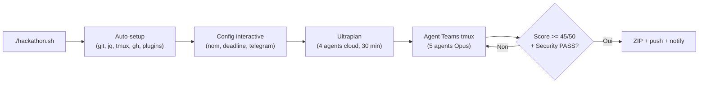
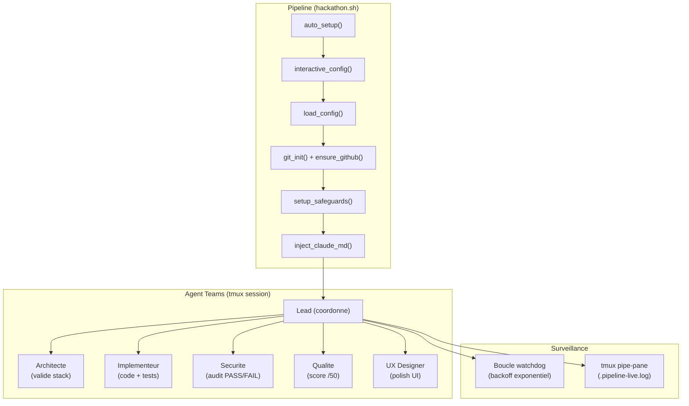

# Hackathon Pipeline

Pipeline autonome qui transforme un brief de hackathon en soumission complète. 5 agents Opus specialises debattent, challengent, et iterent jusqu'au consensus.


## What it does

Tu deposes un brief de hackathon dans `inputs/`. Le pipeline installe ses prerequis, te pose quelques questions de config, lance un ultraplan avec 4 agents Opus dans le cloud, puis demarre 5 Agent Teams dans une session tmux. Les agents recherchent la concurrence, codent, auditent la securite, evaluent la qualite sur 50, et iterent sans limite jusqu'a ce que le score depasse 45/50 et que la securite passe. Tu supervises depuis Telegram ou `--watch`.



## Quick Start

```bash
git clone https://github.com/Andy00L/hackathon-pipeline.git
cd hackathon-pipeline
chmod +x hackathon.sh

# Deposer les fichiers du hackathon
cp ~/Downloads/brief.pdf inputs/
cp ~/Downloads/rules.md inputs/brief.md

# Lancer (le setup est automatique au premier lancement)
./hackathon.sh
```

Le script detecte et installe automatiquement les outils manquants : git, curl, jq, tmux, zip, build-essential, GitHub CLI, et 5 plugins Claude Code.

## Prerequisites

| Outil | Requis | Notes |
|-------|--------|-------|
| WSL2 (Ubuntu) | Oui | Le pipeline tourne sous Linux. Windows natif non supporte. |
| Claude Max 20x | Oui | Abonnement necessaire pour les agents Opus. |
| GitHub CLI (`gh`) | Auto-installe | Le pipeline l'installe si manquant. |
| Claude Code CLI | Oui | Doit etre authentifie (`claude auth login`). |
| Telegram Bot | Non | Recommande pour les notifications et le controle a distance. |

## Architecture



## Configuration

Au premier lancement, `interactive_config()` pose les questions une par une. Les reponses sont sauvegardees dans `hackathon.conf`. Au lancement suivant, la config existante est proposee.

| Variable | Requis | Default | Description |
|----------|--------|---------|-------------|
| `HACKATHON_NAME` | Oui | (aucun) | Nom du hackathon. Sert aussi a generer le slug du dossier projet. |
| `HACKATHON_DEADLINE` | Non | (vide) | Format ISO : `2026-04-20T23:59:00` |
| `HACKATHON_THEME` | Non | (vide) | Theme impose. Vide si libre. |
| `PROJECT_DIR` | Non | `~/hackathons/<slug>` | Dossier du projet genere. Le slug est calcule depuis le nom. |
| `GITHUB_REPO` | Non | (auto-cree) | Repo existant (`user/repo`). Si vide, `gh repo create` en cree un. |
| `GITHUB_VISIBILITY` | Non | `public` | `public` ou `private` |
| `TELEGRAM_BOT_TOKEN` | Non | (vide) | Token du bot Telegram. Cree via `@BotFather`. |
| `TELEGRAM_CHAT_ID` | Non | (auto-detecte) | Detecte automatiquement si le token est valide. |
| `CLAUDE_MODEL` | Non | `opus` | Modele Claude. |
| `CLAUDE_EFFORT` | Non | `max` | Niveau d'effort. |
| `CLAUDE_FALLBACK` | Non | `sonnet` | Modele de fallback. |

Le `PROJECT_DIR` est automatiquement derive du nom du hackathon. Exemple : "Solana DeFi 2026" donne `~/hackathons/solana-defi-2026`. Le pipeline refuse de creer le projet a l'interieur de son propre repertoire.

## CLI Options

```bash
./hackathon.sh                    # Pipeline complet (ultraplan + agents)
./hackathon.sh --skip-ultraplan   # Skip ultraplan (si plan deja fait)
./hackathon.sh --attach           # Attach a la session tmux existante
./hackathon.sh --watch            # Logs filtres en temps reel
./hackathon.sh --help             # Affiche l'aide
```

Le mode `--watch` filtre `.pipeline-live.log` pour n'afficher que les events significatifs : commits, verdicts PASS/FAIL/READY, scores, erreurs, et progressions de phase. Ctrl+C quitte le watch sans arreter la session tmux.

## Les 5 agents

Chaque agent a un fichier de definition dans `agents/` avec un frontmatter YAML (modele, outils, skills) et des instructions detaillees.

| Agent | Modele | Role | Verdict |
|-------|--------|------|---------|
| **Architecte** | Opus | Valide chaque decision technique. 10 criteres en checklist. Recherche comparative via WebSearch. | VALIDE / CONCERN / BLOQUANT |
| **Implementeur** | Sonnet | Code production-quality. Try/catch partout, timeouts 10s, retry x3. Fichiers < 300 lignes. | Commits atomiques |
| **Securite** | Opus | Audit continu : secrets, injections, auth, deps, config. Suit le protocole REFERENCE en 9 phases. | PASS / FAIL |
| **Qualite** | Opus | Evalue /50 sur 5 axes. Test from scratch, comparaison concurrence. Suit le protocole REFERENCE en 7 phases. | READY / NOT READY |
| **UX Designer** | Opus | 6 phases : audit visuel, identite, composants, responsive, a11y, polish. Anti-AI-slop checklist. | Score polish /10 |

Les agents Securite et Qualite disposent chacun d'un REFERENCE file (730+ lignes) qui definit un protocole d'audit professionnel multi-phases. Le Lead s'assure que ces protocoles sont suivis.

## Pipeline flow detail

### Phase 1 : Auto-setup

`auto_setup()` est idempotent. Il verifie chaque outil et n'installe que le manquant :

1. Paquets systeme : git, curl, jq, tmux, zip, build-essential
2. GitHub CLI via le depot officiel
3. Authentification GitHub (`gh auth login` si necessaire)
4. Verification de Claude Code (`claude auth status`)
5. Configuration NOPASSWD sudo
6. 5 plugins Claude Code : frontend-design, security-guidance, code-review, feature-dev, ui-ux-pro-max

### Phase 2 : Ultraplan

4 agents Opus tournent 30 minutes dans le cloud. 3 explorers analysent en parallele, 1 critic challenge. Le plan est review dans un navigateur avec commentaires inline. Confirmation via Telegram ou Entree dans le terminal.

### Phase 3 : Agent Teams

5 agents dans une session tmux interactive. Le Lead coordonne, distribue le travail, et resout les conflits. La session est surveillee par un watchdog avec backoff exponentiel (60s, 120s, 240s, 300s max). Si la session crash, elle est relancee automatiquement. Apres 5 minutes de stabilite, le compteur de relance est reinitialise.

### Terminaison

Le pipeline s'arrete quand toutes ces conditions sont remplies :

- Qualite : READY (score >= 45/50)
- Securite : PASS
- Documentation complete avec liens en ligne
- Tests passent
- Setup fonctionne from scratch
- Archive ZIP creee, git tag v1.0.0, push final

## Safeguards

Le pipeline configure `.claude/settings.json` dans le projet avec deux couches de protection :

**Deny rules** (commandes bloquees statiquement) :
- `gh repo delete`, `gh repo archive`, `gh repo edit`
- `git push --force`, `git push --force-with-lease`
- `rm -rf /`, `rm -rf ~`, `rm -rf /*`

**Hook PreToolUse** (inspection dynamique) :
Chaque commande Bash est interceptee avant execution. Le hook extrait la commande via `jq`, verifie les patterns dangereux avec `grep`, et bloque si necessaire. Les acces au filesystem Windows (`/mnt/c/`, `/mnt/d/`, `/mnt/e/`) sont egalement bloques pour eviter les modifications hors WSL.

## Project structure

```
hackathon-pipeline/
├── hackathon.sh                 # Point d'entree (793 lignes, auto-setup + orchestration)
├── hackathon.conf.example       # Template de config (11 variables)
├── .gitignore                   # hackathon.conf, *.log, .ultraplan-done
├── agents/
│   ├── architecte.md            # Challenge les choix techniques (93 lignes)
│   ├── implementeur.md          # Code production-quality (109 lignes)
│   ├── securite.md              # Audit continu + PASS/FAIL (117 lignes)
│   ├── qualite.md               # Evaluation /50 + READY/NOT READY (175 lignes)
│   └── uiux-designer.md         # Design premium, anti-AI-slop (125 lignes)
├── templates/
│   └── CLAUDE.md.template       # Instructions du pipeline, 9 phases (491 lignes)
├── REFERENCE_SECURITY_AUDIT.md  # Protocole securite 9 phases (881 lignes)
├── REFERENCE_DOCUMENTATION_AUDIT.md  # Protocole documentation 7 phases (729 lignes)
└── inputs/                      # Deposer les fichiers du hackathon ici
```

## Telegram setup

1. Ouvre `@BotFather` sur Telegram
2. `/newbot`, choisis un nom et username (doit finir par `bot`)
3. Copie le token retourne
4. Lance `./hackathon.sh`, le token est demande pendant la config interactive
5. Le Chat ID est detecte automatiquement : envoie un message au bot, appuie sur Entree

Si la detection echoue (timeout reseau, pas de message), le pipeline propose la saisie manuelle. Si le token est invalide, Telegram est desactive. Le pipeline fonctionne sans Telegram mais ne peut pas notifier.

## Watch mode

```bash
# Dans un terminal separe, pendant que le pipeline tourne :
./hackathon.sh --watch
```

Le watch filtre le log tmux en temps reel. Seuls les events significatifs sont affiches : commits (`feat:`, `fix:`), verdicts (`PASS`, `FAIL`, `READY`), scores, erreurs, et changements de phase. Le log brut est dans `$PROJECT_DIR/.pipeline-live.log`.

## Known limitations

- **lib/ manquant** : `hackathon.sh` source `lib/utils.sh` et `lib/telegram.sh`. Ces fichiers doivent exister dans le repo. Si absents, le pipeline crash au demarrage.
- **WSL2 only** : Le pipeline utilise `apt-get`, `dpkg`, et des chemins Linux. Pas de support macOS ou Windows natif.
- **Claude Max requis** : Les agents Opus consomment du quota. Sur un plan gratuit ou Pro, les limites seront atteintes rapidement.
- **Session tmux unique** : Un seul hackathon peut tourner a la fois (session nommee `hackathon`).
- **Pas de resume intelligent** : Si la session crash et est relancee, le prompt de recovery demande aux agents de relire CLAUDE.md et le git log. Le contexte conversationnel est perdu.
- **Plugins Claude Code** : Les plugins (`frontend-design`, `security-guidance`, etc.) peuvent ne pas etre disponibles ou changer de nom. L'installation echoue silencieusement si un plugin est introuvable.

## Troubleshooting

**La session tmux a disparu**
Le watchdog la relance automatiquement avec backoff exponentiel. Pour verifier : `tmux ls`. Pour relancer manuellement : `./hackathon.sh --skip-ultraplan`.

**Rate limit atteint**
Claude attend et reprend. Sur Max 20x, les limites sont rarement atteintes. Active "extra usage" dans les settings Claude si necessaire.

**Claude demande un mot de passe sudo**
Relance `./hackathon.sh`. `auto_setup()` configure NOPASSWD au premier lancement.

**Le setup echoue**
Verifie que Claude Code est authentifie : `claude auth status`. Verifie GitHub : `gh auth status`.

**Pas de notification Telegram**
Verifie le token : `curl -s "https://api.telegram.org/bot<TOKEN>/getMe"`. Si le JSON retourne `"ok": false`, le token est invalide. Recree un bot via `@BotFather`.

## Contributing

```bash
# Clone et branche
git clone https://github.com/Andy00L/hackathon-pipeline.git
cd hackathon-pipeline
git checkout -b feature/ma-feature

# Verifier la syntaxe apres modification
bash -n hackathon.sh

# Tester
./hackathon.sh --help
```

Les fichiers agents (`agents/*.md`) suivent un format strict : frontmatter YAML + instructions structurees avec checklists, commandes bash, et formats de sortie. Voir `agents/securite.md` comme reference du niveau de detail attendu.

## License

MIT
