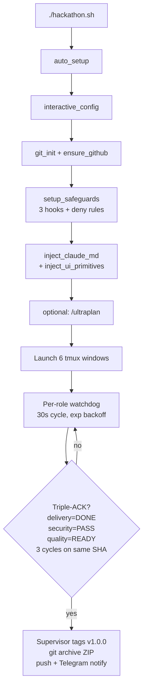

# Hackathon Pipeline

A bash launcher plus a Python MCP coordinator that drive four Claude Code orchestrators and a pool of specialist sub-agents. You drop a hackathon brief in `inputs/`, the pipeline sets up the environment, and the orchestrators iterate through implementation, security, and quality gates until a triple-ACK termination condition is reached.


## Quick Start

```bash
git clone https://github.com/Andy00L/hackathon-pipeline.git
cd hackathon-pipeline
chmod +x hackathon.sh

# Put the brief and any other material into inputs/
cp ~/Downloads/brief.md inputs/brief.md
cp ~/Downloads/rules.pdf inputs/

# First run: auto-setup, interactive config, then pipeline
./hackathon.sh
```

The first run installs missing tools (git, jq, tmux, zip, build-essential, GitHub CLI, 4 Claude Code plugins + the ui-ux-pro-max marketplace skill), configures passwordless sudo for `apt-get`/`mkdir`/`tee`/`chmod`, walks through an interactive config, then launches the orchestration mesh. Subsequent runs skip any step that's already done.

## What it does

1. Auto-installs prerequisites and authenticates Claude Code and GitHub CLI.
2. Asks you 7 questions (name, deadline, theme, project directory, GitHub repo, Telegram bot token, chat ID) and writes `hackathon.conf`.
3. Initializes a git repo and optionally a GitHub repo in `$PROJECT_DIR` (default `~/hackathons/<slug>`).
4. Generates `CLAUDE.md` from `templates/CLAUDE.md.template`, copies `agents/` into `.claude/agents/`, writes `.claude/settings.json` with deny rules and 3 hooks, and copies the `ui-primitives/` starter kit.
5. Prompts you to run `/ultraplan` manually in another terminal (skippable with `--skip-ultraplan`).
6. Launches 6 tmux windows in a session named `hackathon`: one MCP server, one bootstrap, four long-running orchestrators (supervisor, delivery, security, quality).
7. The orchestrators communicate through the MCP server's 8 tools, iterate on the code, and terminate when delivery reports DONE, security reports PASS, and quality reports READY on the same `HEAD` for 3 consecutive cycles.

## Architecture



The triple-ACK gate is what keeps the pipeline from finishing on a half-built submission. If any of the three verdicts goes stale because `HEAD` advanced, the stability counter resets to 0 and the mesh keeps iterating. See [ARCHITECTURE.md](ARCHITECTURE.md) for the full protocol.

## Project structure

```
hackathon-pipeline/
├── hackathon.sh                            # Entry point, 1537 lines
├── hackathon.conf.example                  # Config template, 11 variables
├── lib/
│   ├── utils.sh                            # 231 lines, 7 functions
│   └── telegram.sh                         # 98 lines, 3 functions
├── mcp-coord/
│   ├── server.py                           # 869 lines, 8 MCP tools
│   ├── orchestrator_wrapper.py             # 352 lines, streaming loop
│   ├── client_helper.py                    # 175 lines, used by PostToolUse hook
│   ├── requirements.txt                    # mcp==1.27.0
│   └── tests/                              # 24 tests, pytest
├── .claude/
│   ├── orchestrators/                      # 5 prompt files (bootstrap, supervisor, delivery, security, quality)
│   └── settings.local.json                 # user-local permissions
├── agents/                                 # 15 sub-agent definitions
├── templates/
│   ├── CLAUDE.md.template                  # 764 lines, injected into the target project
│   ├── hooks/                              # 3 hooks: pretooluse, posttooluse, precompact
│   └── ui-primitives/                      # 9 primitives + globals.css + fonts.ts
├── inputs/                                 # drop the brief here
├── docs/
│   └── PIPELINE-SMOKE-REPORT.md            # static-check + integration snapshot
├── REFERENCE_SECURITY_AUDIT.md             # 729 lines, 9-phase protocol
├── REFERENCE_DOCUMENTATION_AUDIT.md        # 881 lines, 7-phase protocol
├── REFERENCE_PREMIUM_UI.md                 # 1487 lines, UI design protocol
└── ARCHITECTURE.md                         # system design + sequence diagrams
```

## CLI modes

```bash
./hackathon.sh                    # full pipeline (auto-setup, ultraplan, orchestration)
./hackathon.sh --skip-ultraplan   # skip ultraplan, go straight to orchestration
./hackathon.sh --attach           # attach to an existing tmux session, no setup
./hackathon.sh --watch            # tail-f filtered live log, no setup
./hackathon.sh --help             # usage
DRY_RUN=1 ./hackathon.sh          # print the 6 tmux window commands and exit
```

`--watch` tails `$PROJECT_DIR/.pipeline-live.log` and filters for the significant events (commits, PASS/FAIL/READY verdicts, scores, errors, phase changes, human-input markers). Ctrl+C quits the watch without stopping the tmux session.

## Configuration

Set in `hackathon.conf`. The interactive prompt writes this file on first run and proposes the existing values on subsequent runs. All values are shell-quoted; `_escape_conf_value()` in `hackathon.sh` escapes backslashes, dollar signs, backticks, and double quotes.

| Variable | Required | Default | Notes |
|---|---|---|---|
| `HACKATHON_NAME` | yes | (none) | Used for the project slug and log directory. |
| `HACKATHON_DEADLINE` | no | (empty) | Free-form string, ISO 8601 recommended. |
| `HACKATHON_THEME` | no | (empty) | Free-form. Passed to orchestrators via `CLAUDE.md`. |
| `PROJECT_DIR` | no | `$HOME/hackathons/<slug>` | Refused if it resolves inside the pipeline repo. |
| `GITHUB_REPO` | no | (auto-created) | Format `user/repo`. Empty → `gh repo create`. |
| `GITHUB_VISIBILITY` | no | `public` | `public` or `private`. |
| `TELEGRAM_BOT_TOKEN` | no | (empty) | Created via `@BotFather`. Empty disables Telegram. |
| `TELEGRAM_CHAT_ID` | no | (auto-detected) | Detected from recent bot updates. |
| `CLAUDE_MODEL` | no | `opus` | Must match `[a-zA-Z0-9._-]+`. |
| `CLAUDE_EFFORT` | no | `max` | Must match `[a-zA-Z0-9._-]+`. |
| `CLAUDE_FALLBACK` | no | `sonnet` | Declared but not currently referenced in `hackathon.sh`. |

Runtime env vars read by Python:

| Variable | Reader | Default |
|---|---|---|
| `PIPELINE_DIR` | `mcp-coord/server.py` | `<repo>/.pipeline` |
| `REPO_ROOT` | `mcp-coord/server.py` | parent of `mcp-coord/` |
| `CLAUDE_PROJECT_DIR` | `mcp-coord/client_helper.py`, hooks | caller's cwd |
| `CLAUDE_SESSION_ID` | `templates/hooks/precompact-checkpoint.sh` | `unknown-<pid>` |

## The 6-window tmux layout

| Window | Process | Purpose |
|---|---|---|
| 0. `mcp` | `python3 mcp-coord/server.py` | stdio JSON-RPC coordination server |
| 1. `bootstrap` | `claude --print` (one-shot) | Produces `notes/BRIEF-DISTILLED.md` and `notes/PACKAGES.md`, then exits |
| 2. `supervisor` | `orchestrator_wrapper.py` | Pipeline lifecycle, dispatch, triple-ACK termination |
| 3. `delivery` | `orchestrator_wrapper.py` | Writes code, tests, configs, README |
| 4. `security` | `orchestrator_wrapper.py` | Audits every new SHA, writes `docs/SECURITY-AUDIT.md` |
| 5. `quality` | `orchestrator_wrapper.py` | Scores /50, writes `docs/QUALITY-REPORT.md` |

Each orchestrator runs in its own tmux pane. `orchestrator_wrapper.py` spawns `claude --print --input-format stream-json` as a subprocess and feeds it a "continue your cycle" message every 60 seconds. The wrapper writes an atomic heartbeat to `.pipeline/heartbeat/<role>.txt` on each cycle; the bash watchdog in `hackathon.sh` uses that to detect stalls.

Session IDs are deterministic UUIDv5 per role (`uuid.uuid5(uuid.NAMESPACE_URL, "{role}.pipeline.hackathon")`), so `--resume` always finds the right session.

## Sub-agents

15 specialist agents live in `agents/`. Orchestrators spawn them via the `Agent` tool and aggregate their verdicts.

| Agent | Model | Spawned by | Role |
|---|---|---|---|
| `architecte` | opus | delivery | 10-item architecture checklist, verdict VALID / CONCERN / BLOQUANT |
| `implementeur` | sonnet | delivery | Writes code. Hard cap: 400 LOC, 8 files, 1 new dep per task |
| `test-writer` | sonnet | delivery | Edge-case tests only (empty, null, oversized, unicode, negative, concurrent, network-down) |
| `readme-specialist` | sonnet | delivery | Writes `README.md`, `docs/ARCHITECTURE.md`, `docs/DEMO.md` |
| `docs-reader` | opus | bootstrap + on demand | Distills `inputs/*` into `notes/BRIEF-DISTILLED.md` |
| `package-research` | opus | bootstrap + quality | Verifies dep versions via WebSearch + WebFetch |
| `injection-specialist` | opus | security | OWASP A01/A03/A10: SQLi, XSS, command injection, path traversal, SSRF, XXE, open redirect, template injection |
| `secrets-config-specialist` | opus | security | OWASP A05/A06: hardcoded credentials, .env hygiene, CORS, security headers, Dockerfile perms |
| `auth-crypto-specialist` | opus | security | OWASP A02/A07: password hashing, JWT, session, RBAC, crypto primitives |
| `deps-auditor` | opus | security (conditional) | Runs `npm audit` / `pip audit` / `cargo audit` when lockfiles change |
| `threat-modeler` | opus | security (gate-time) | Produces `docs/THREAT-MODEL.md` with a Mermaid trust-boundary diagram |
| `scratch-tester` | opus | quality | mktemp + clone + run Quick Start verbatim, times each command |
| `code-quality-reviewer` | opus | quality | File size ≤300 LOC, complexity, dead code, lint, coverage |
| `ui-quality-reviewer` | opus | quality | Polish, responsive 375-1440px, WCAG AA, anti-AI-slop checklist |
| `docs-auditor` | opus | quality | Runs the 7-phase protocol from `REFERENCE_DOCUMENTATION_AUDIT.md` |

Sub-agents cannot spawn sub-agents. They return structured verdicts; their context is discarded when they return. Only orchestrators interact with the MCP server.

## MCP coordinator

`mcp-coord/server.py` is a FastMCP stdio server that exposes 8 tools. All inter-orchestrator communication flows through it.

| Tool | Semantics |
|---|---|
| `post_message(from, to, topic, payload, [message_id], [sha])` | Appends a JSON line to `.pipeline/inbox/<to>.jsonl`. Dedup by `message_id` within 24h. |
| `claim_next(role)` | Atomically pops the oldest unclaimed message (flock + seek+truncate, O(n) I/O, O(1) RAM). |
| `record_verdict(role, status, sha, [evidence], [findings])` | Appends to `.pipeline/verdicts.jsonl`. Status domain depends on role. |
| `request_gate(gate_name)` | Reads the supervisor's cached gate decision from `.pipeline/state.json`. Returns `stale` if older than 300s. |
| `get_latest_diff(since_ref)` | `git diff --unified=3 <since_ref>..HEAD`, truncated at 64 KiB. |
| `acquire_file_lock(path, owner, [ttl_seconds])` | O_EXCL create in `.pipeline/locks/<sha1>.lock`. Default TTL 120s. Expired locks are taken over with an audit line. |
| `release_file_lock(path, token)` | Token-verified. Audited. |
| `heartbeat(role)` | Writes unix timestamp to `.pipeline/heartbeat/<role>.txt`. |

The server uses `fcntl.flock` for inbox locking and `O_APPEND + fsync` for the JSONL stores. It writes its own log to `.pipeline/mcp-server.log` (file-only logging; stderr stays clear because the stdio channel carries JSON-RPC). More detail and file-layout diagrams in [mcp-coord/README.md](mcp-coord/README.md).

## Safeguards

`setup_safeguards()` writes `$PROJECT_DIR/.claude/settings.json` with three layers:

**Static deny rules** (17 entries): `gh repo delete|archive|edit`, `git push --force` (3 variants, plus `git push origin --force`), `git reset --hard`, `rm -rf /`, `rm -rf ~`, `rm -rf /*`, `rm -rf .`, `rm -r -f *`, `chmod 777`, `chmod -R 777`, `mkfs.*`, `dd if=*`.

**Three hooks** in `templates/hooks/`:

| Hook | Event | Behavior |
|---|---|---|
| `pretooluse-safeguard.sh` | PreToolUse (matcher: Bash) | Parses `.tool_input.command`, denies on 12 dangerous regexes + `/mnt/[a-z]/` Windows access. Fails closed if `jq` is missing. |
| `posttooluse-fanout.sh` | PostToolUse (matcher: Edit\|Write\|MultiEdit) | If the write landed in `src/`, `tests/`, or a buildfile, posts `review_diff` to security and `new_feature` to quality via `client_helper.py`. Debounced 30s per SHA. |
| `precompact-checkpoint.sh` | PreCompact | Writes `.pipeline/checkpoint/<role>.md` with last SHA, inbox count, and last 5 verdicts before Claude Code compacts the conversation. |

**Watchdog recovery**: the bash loop at the bottom of `hackathon.sh` cycles every 30s. For each orchestrator role, it checks window liveness, pane exit code, and heartbeat freshness (<120s after a 60s grace period). On failure it respawns via `orchestrator_wrapper.py` which uses `--resume` when a log exists. Backoff ladder: 30 → 60 → 120 → 300s, reset to 30s after 5 consecutive minutes of stability. Exit code 42 (context-pressure checkpoint) triggers an immediate respawn with no backoff.

## Telegram

Optional. Used for progress notifications and the `HUMAN_INPUT_NEEDED` escalation path.

1. Open `@BotFather`, `/newbot`, copy the token.
2. Send any message to the bot (required so its first update carries your chat ID).
3. Run `./hackathon.sh`. When asked, paste the token; press Enter when prompted and the pipeline calls `getUpdates` to detect the chat ID automatically (3 retries with manual fallback).

If the token is invalid, `tg_init()` in `lib/telegram.sh` logs a warning and sets `TELEGRAM_ENABLED=false`. `tg_send` becomes a no-op; nothing else breaks.

The watchdog checks `docs/STATUS.md` every 3 cycles (~90s) for a `## HUMAN_INPUT_NEEDED` block. If the block's sha1 has changed since the last send, the watchdog sanitizes known API-key prefixes (`hc_live_`, `sk-`, `ghp_`, `xox[bpsa]-`, `glpat-`, `AKIA`), truncates to 3800 bytes (Telegram's limit is 4096), and forwards to the chat.

## Tests

```bash
cd mcp-coord
python3 -m venv .venv && source .venv/bin/activate
pip install -r requirements.txt

python3 -m pytest tests -q
# 24 passed in ~4s
```

23 unit tests in `tests/test_server.py` cover round-trip messaging, dedup, verdict ordering, role/topic/status validation, lock contention and TTL, path traversal rejection, and wrong-token rejection. 1 integration test in `tests/test_integration.py` walks a `post_message → claim_next → record_verdict` round-trip. Full report in [docs/PIPELINE-SMOKE-REPORT.md](docs/PIPELINE-SMOKE-REPORT.md).

## Known limitations

- **Linux / WSL2 only.** `mcp-coord/server.py` imports `fcntl` at module top and refuses to start on Windows natively. `auto_setup` uses `apt-get`, `dpkg`, and Ubuntu package names.
- **One pipeline per machine.** Only one tmux session named `hackathon` is supported; a lock file at `$PROJECT_DIR/.pipeline.lock` prevents two concurrent `./hackathon.sh` invocations.
- **Claude plugin availability.** `auto_setup` calls `claude plugin install` for 4 plugins + 1 marketplace skill. If a plugin has been renamed or removed upstream, installation logs a `~` and continues; orchestrators that rely on `ui-ux-pro-max` will still run but may skip some stylistic checks.
- **No state resume across machines.** Session UUIDs are deterministic per role but `--resume` reads Claude Code's local conversation store. Moving the repo to another machine starts the orchestrators fresh.
- **Bootstrap is one-shot.** If `notes/BRIEF-DISTILLED.md` or `notes/PACKAGES.md` is damaged mid-run, the watchdog will not respawn bootstrap. Delete them and restart the pipeline.
- **Python venv detection is narrow.** `hackathon.sh` prefers `mcp-coord/.venv/bin/python3`, falls back to system `python3` if it can `import mcp`, otherwise exits. A stale venv that has the binary but not the `mcp` module will fail the import check.
- **`cli.github.com/packages` returned 404** in the last smoke test (see `docs/PIPELINE-SMOKE-REPORT.md`). The APT source still works; the human-readable index page is gone.

## Documentation

| File | What's in it |
|---|---|
| [README.md](README.md) | This file. Overview, Quick Start, config reference. |
| [ARCHITECTURE.md](ARCHITECTURE.md) | System design, MCP protocol, message topics, sole-writer table, triple-ACK termination, watchdog state machine. |
| [mcp-coord/README.md](mcp-coord/README.md) | MCP server setup, tool reference, `.pipeline/` layout. |
| [REFERENCE_SECURITY_AUDIT.md](REFERENCE_SECURITY_AUDIT.md) | 9-phase security audit protocol used by the security orchestrator. |
| [REFERENCE_DOCUMENTATION_AUDIT.md](REFERENCE_DOCUMENTATION_AUDIT.md) | 7-phase documentation audit protocol used by `docs-auditor`. |
| [REFERENCE_PREMIUM_UI.md](REFERENCE_PREMIUM_UI.md) | UI design reference used by `ui-quality-reviewer`. |
| [templates/CLAUDE.md.template](templates/CLAUDE.md.template) | 764-line contract injected into the target project as `CLAUDE.md`. |
| [templates/ui-primitives/README.md](templates/ui-primitives/README.md) | Starter-kit primitives and extension rules. |
| [templates/ui-primitives/DESIGN-PRINCIPLES.md](templates/ui-primitives/DESIGN-PRINCIPLES.md) | Color tokens, easing curves, anti-AI-slop patterns. |
| [docs/PIPELINE-SMOKE-REPORT.md](docs/PIPELINE-SMOKE-REPORT.md) | Latest static-check, unit-test, hook, MCP, and dry-run results. |

## Contributing

```bash
git checkout -b fix/your-thing

# syntax checks
bash -n hackathon.sh
bash -n lib/utils.sh
bash -n lib/telegram.sh
shellcheck --severity=warning hackathon.sh templates/hooks/*.sh

# unit tests
source mcp-coord/.venv/bin/activate
python3 -m pytest mcp-coord/tests -q

# dry-run the launcher (prints window commands, no tmux)
DRY_RUN=1 ./hackathon.sh
```

`agents/*.md` files all start with YAML frontmatter (`name`, `description`, `model`, `effort`, `maxTurns`, `permissionMode`, `tools`, optional `skills`). See `agents/architecte.md` for the current template. The check at `hackathon.sh:984` refuses to launch if fewer than 15 files are present in `agents/`.

## License

MIT (declared in README badge; no `LICENSE` file is currently committed, which is a gap).
