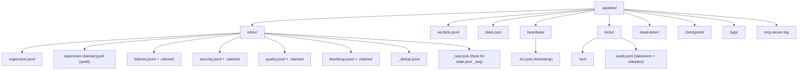

# MCP Coordination Server

Stdio MCP server that exposes 8 tools used by the four long-running orchestrators (supervisor, delivery, security, quality) and the one-shot bootstrap. Transport is JSON-RPC 2.0 over stdin/stdout. All state is written to `.pipeline/` on disk; the server keeps no in-memory authoritative state beyond a dedup cache for `message_id`.

Parent: [../README.md](../README.md). Protocol context: [../ARCHITECTURE.md](../ARCHITECTURE.md).

## Setup

```bash
cd mcp-coord
python3 -m venv .venv && source .venv/bin/activate
pip install -r requirements.txt
# requirements.txt pins: mcp==1.27.0
```

## Run standalone

```bash
python3 mcp-coord/server.py          # reads JSON-RPC from stdin
python3 mcp-coord/server.py < /dev/null  # exits cleanly on EOF
```

The server uses `FastMCP("pipeline-coordinator")` and `server.run(transport="stdio")`. It refuses to start on platforms without `fcntl` (Windows natively). Logging goes to `.pipeline/mcp-server.log` (file handler only) because stderr is reserved for the JSON-RPC channel.

## Configuration

Read from the environment, not from CLI flags:

| Variable | Default | Purpose |
|---|---|---|
| `PIPELINE_DIR` | `<repo>/.pipeline` | Root of the coordination state tree. |
| `REPO_ROOT` | parent of `mcp-coord/` | Used by `get_latest_diff` (cwd for `git`) and by `acquire_file_lock` to reject absolute paths outside the repo. |

`hackathon.sh` writes `<PROJECT_DIR>/.pipeline/mcp.json` pointing at the venv python, then passes `--mcp-config <that_path>` to each claude process. The file looks like:

```json
{
  "mcpServers": {
    "pipeline-coordinator": {
      "command": "python3",
      "args": ["mcp-coord/server.py"],
      "env": {
        "PIPELINE_DIR": ".pipeline"
      }
    }
  }
}
```

## Run tests

```bash
source mcp-coord/.venv/bin/activate
python3 -m pytest mcp-coord/tests -q
# 24 passed
```

23 unit tests in `tests/test_server.py` + 1 integration round-trip in `tests/test_integration.py`. See `docs/PIPELINE-SMOKE-REPORT.md` for the most recent results.

## Tools

All 8 tools return a JSON string. Errors use `{"status": "error", "error": "..."}`; success uses a tool-specific shape.

| Tool | Signature | Success shape |
|---|---|---|
| `post_message` | `(from_role, to_role, topic, payload, message_id="", sha="")` | `{status: "posted", message_id, bytes}` or `{status: "duplicate", message_id}` |
| `claim_next` | `(role)` | full message object, or `{status: "empty"}` |
| `record_verdict` | `(role, status, sha, evidence="", findings="")` | `{status: "recorded", id}` |
| `request_gate` | `(gate_name)` | `{status: "ok", gate, decision, ts}`, `{status: "no_decision"}`, or `{status: "stale", age_seconds}` |
| `get_latest_diff` | `(since_ref)` | `{changed_files, diff, truncated?}` |
| `acquire_file_lock` | `(path, owner, ttl_seconds=120)` | `{status: "acquired", token}` or `{status: "held", held_by, expires_in}` |
| `release_file_lock` | `(path, token)` | `{status: "released"}` or `{status: "rejected", held_by}` |
| `heartbeat` | `(role)` | `{status: "ok", ts}` |

Valid role set: `{supervisor, delivery, security, quality, bootstrap}`.

Valid topic set (20): `implement`, `review_diff`, `new_feature`, `sec_ok`, `finding`, `regression`, `fix_applied`, `blocked`, `veto`, `veto_last_commit`, `lock_conflict`, `context_pressure`, `gate_security`, `gate_quality`, `ping`, `shutdown`, `suggest_edit`, `split_request`, `stuck`, `conflict`.

Verdict status whitelist:
- `delivery`: `IN_PROGRESS | BUILT | DONE | BLOCKED`
- `security`: `PASS | FAIL | STALE`
- `quality`: `READY | READY_WITH_FIXES | NOT_READY | STALE`

Gate names: `{gate_security, gate_quality, gate_terminate}`. Gate decisions older than 300s are returned as `{status: "stale"}`.

## Filesystem layout



## Concurrency invariants

- `_atomic_append` uses `O_WRONLY | O_CREAT | O_APPEND` + `fsync`, so no two concurrent writers can interleave within a line.
- `claim_next` holds `flock(LOCK_EX)` while it seeks-and-truncates. Reads the first line, copies the rest forward in 65536-byte chunks, truncates to the new size. O(n) I/O, O(1) RAM regardless of inbox size.
- `_next_seq` locks a dedicated `_seq.lock` file (so it does not contend with inbox flocks), reads `state.json`, bumps `_seq`, writes atomically via `_atomic_write_json` (tmp-fsync-rename).
- `acquire_file_lock` attempts `O_EXCL` first; on collision, checks the holder's TTL; if expired, deletes and retries `O_EXCL`. The audit trail at `.pipeline/locks/audit.jsonl` records every takeover.

## Dead-letter

Any `claim_next` that encounters malformed JSON moves the raw bytes to `.pipeline/dead-letter/<ULID>.json` with `{raw, reason, ts}`. The method then returns `{status: "error", "error": "malformed message moved to dead-letter"}`. The orchestrators log the event to `docs/STATUS.md` but do not retry. The dead-letter is for human review.

## Message format

Every message appended to `inbox/<role>.jsonl` has this exact shape (with `sha` optional):

```json
{
  "message_id": "01J...ULID",
  "from": "supervisor",
  "to": "delivery",
  "topic": "implement",
  "payload": "...arbitrary string, typically JSON...",
  "ts": 1745408000.123,
  "seq": 42,
  "sha": "abc123def456"
}
```

`message_id` is a 26-char ULID (crockford base32, time-ordered). The server generates one if the caller omits it. Duplicate `message_id` within a 24h window returns `{status: "duplicate"}` and does NOT append a second copy. Sequence numbers (`seq`) are monotonically assigned per-server and stored in `state.json._seq`.

## Verdict format

Each line in `verdicts.jsonl`:

```json
{
  "id": "01J...ULID",
  "role": "security",
  "status": "PASS",
  "sha": "abc123def456",
  "ts": 1745408000.123,
  "seq": 43,
  "evidence": "no critical/high findings open",
  "findings": "MEDIUM:2 LOW:5"
}
```

`evidence` and `findings` are optional. When the supervisor reads `verdicts.jsonl`, it keeps only the highest-`seq` record per `(role, sha)`. A newer verdict for the same `(role, sha)` supersedes the older one.

## Tradeoffs

- **No in-process HTTP server.** Communication is stdio, not sockets. This means one Claude Code client per MCP instance (fine for our 4 orchestrators, not suitable for a multi-host setup).
- **No schema migration.** The JSONL files do not carry a version field. Changing the message or verdict shape requires clearing `.pipeline/` and starting over.
- **Single-node only.** `fcntl.flock` is process-local. The pipeline cannot be sharded across machines or containers without a different locking primitive.
- **Debuggability over speed.** `fsync` on every append means each message survives a crash, at the cost of ~1ms per post. On a typical run with <1 message/second per role, this is invisible.

## Related files

- [../hackathon.sh](../hackathon.sh): the launcher. Patches `mcp.json` at startup and runs the watchdog.
- [orchestrator_wrapper.py](orchestrator_wrapper.py): streaming-input wrapper that drives each long-running orchestrator.
- [client_helper.py](client_helper.py): standalone `post_message` CLI used by `templates/hooks/posttooluse-fanout.sh` when the MCP server is not easily reachable.
- [../.pipeline/README.md](../.pipeline/README.md): quick reference for the runtime state directory.

[Back to main README](../README.md)
